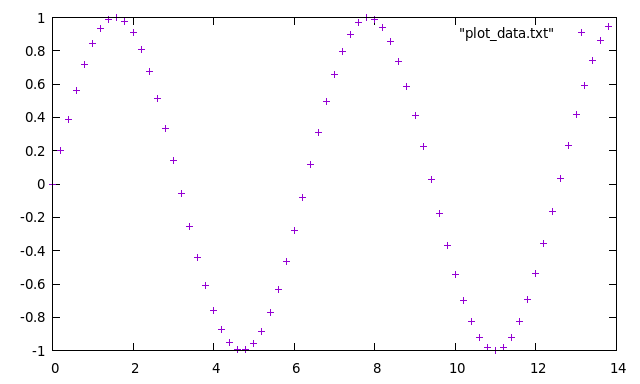

# Grid Creation 

Develop simple code to define:
  - a _n_-point grid along the x axis starting from _x0_ and with spacing _h_
  - a _n_+1 point grid inside the range [_a_,_b_]
  
  then compute the _sin_ function along that grid and plot it with gnuplot
  
  
