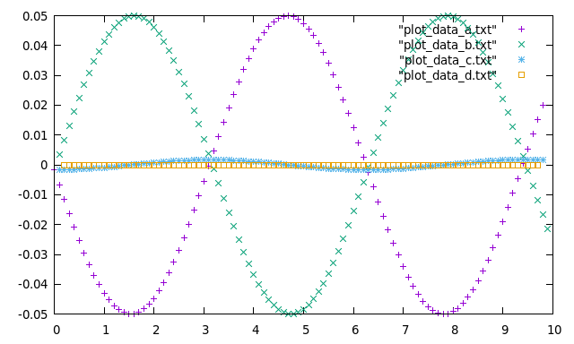

# Derivatives and Integrals

1. Consider _f(x) = sin(x)_ with a equi-spaced grid (_x0_ = 0, _h_ = 0.1, _n_ = 100) and compute _df(x)/dx_ using:
     -  method from right and from left
     -  method
     -  method
      
   and plot _df(x)/dx - cos(x)_
   
   
   
   2. Compute the integral  using:
      * Rectangles rule
      - Trapezoidal rule
      - Simpson's rule
