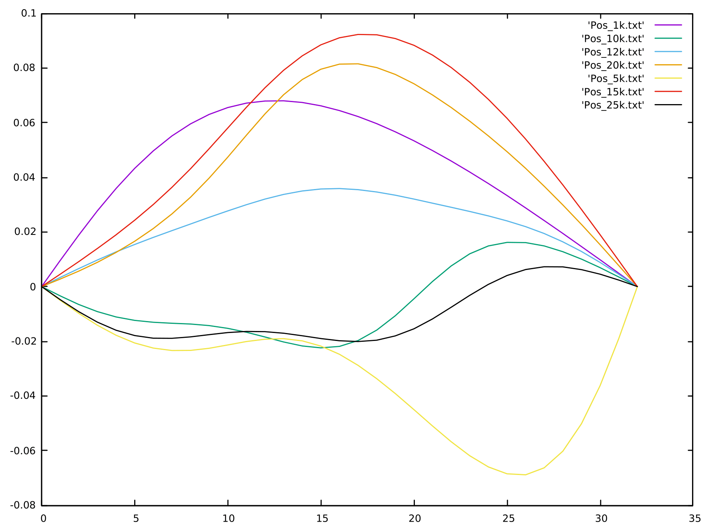
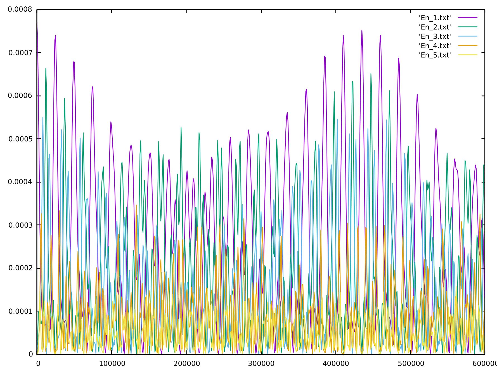

# Fermi Pasta Ulam

Consider the Fermi Pasta Ulam problem and integrate the motion equations using _Velocity Verlet_ algorithm.
Motion gif            |  State of the system at different times
:-------------------------:|:-------------------------:
 | 

Then plot the energies of the lower normal oscillation modes
FPU period            |  FPUM superperiod
:-------------------------:|:-------------------------:
 | 

