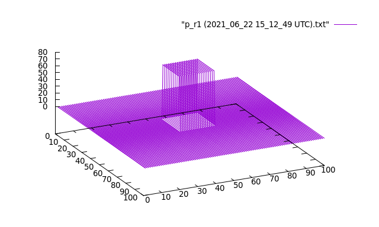
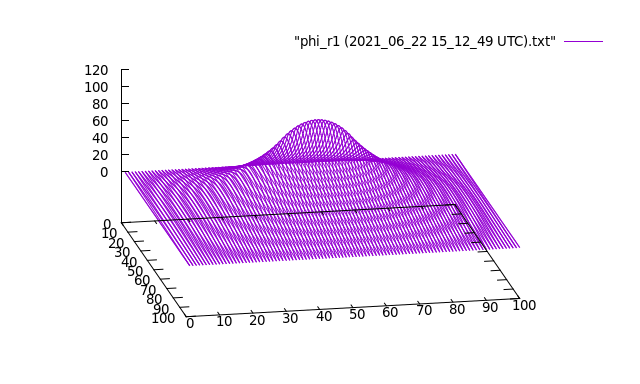
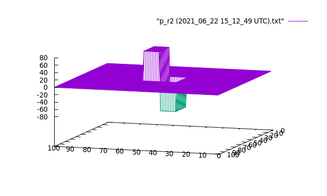
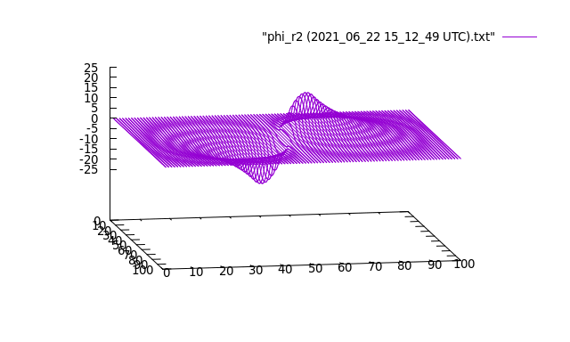
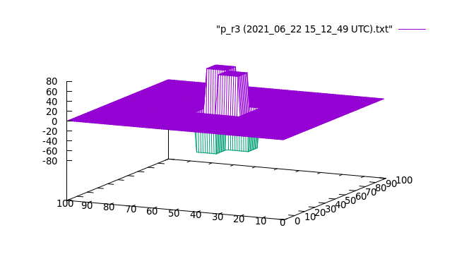
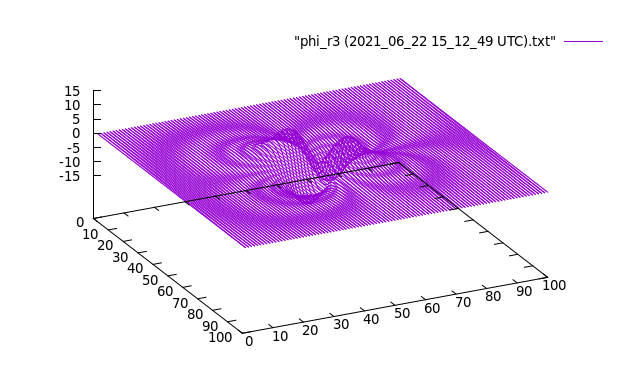

# Poisson Equation

Consider the Poisson Equation  in the 2d case.
Apply the boundary condition of having null charge distribution at the borders and compute the potential using the iterative _Jacobi_ algorithm.

Charge distribution 1            |  Potential 1
:-------------------------:|:-------------------------:
 | 

Charge distribution 2            |  Potential 2
:-------------------------:|:-------------------------:
 | 

Charge distribution 3            |  Potential 3
:-------------------------:|:-------------------------:
 | 
