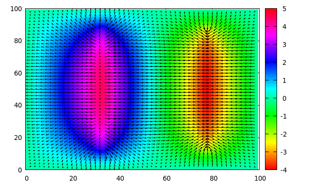
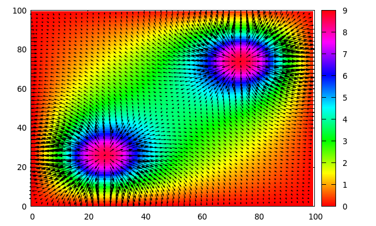
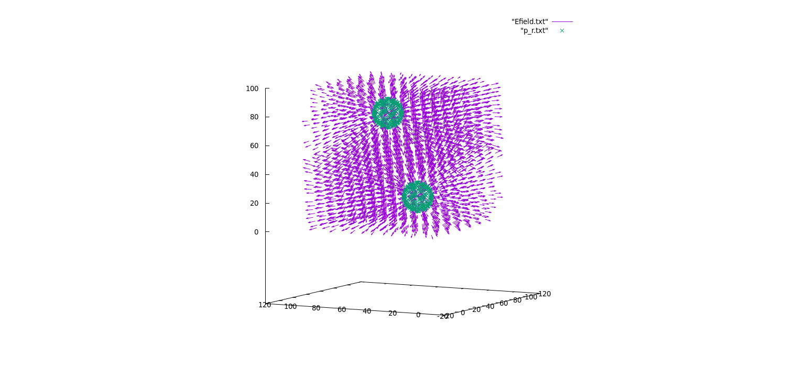

# Electric Fields and Potentials

I computed the electric field and potential for 2D capacitor and 2D & 3D metal spheres. In practical I solved the Poisson Equation using the iterative _Jacobi_ algorithm.

## 2D Capacitor

## 2D Metallic Spheres

## 3D Metallic Spheres

